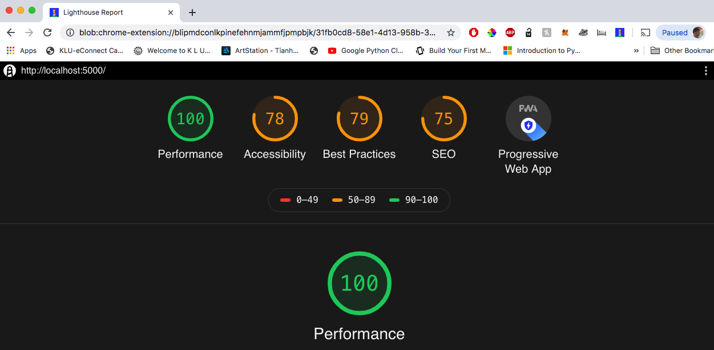

CFSN - A Progressive  Web Application powered by NewsAPI(newsapi.org):fire:
 
We've always thought about how a personalised news feed would be like. Look no further! Backed by the NewsAPI, we are able to receive personalised news at through multiple sources and from several categories.

By using a service-worker, we are able to store any static content and access the web app even while offline. Once we load the website, the service worker is registered and is the cache is updated everytime we reload the web app. This allows for the web app's loading time to match that of a native app.
 
 
### `To install any dependencies`
#### `npm install`
 
### `To run the app in Development Mode`
#### `npm start`

Runs the app in the development mode. 
Open [http://localhost:3000](http://localhost:3000) to view it in the browser.

The page will reload if you make edits. 
You will also see any lint errors in the console. 
Perks of hot-reloading. :)
 
### `To test the Service Worker`
 

#### `npm run build`

We must build the app and run an http server from our build directory in order to see the Service Worker's effect because it is only enabled in production environment.
It is optimal to run it in incognito mode to avoid issues with your current browser cache.
 
### `Running the application with ServiceWorker:`
Once the application is build for production , we can serve it locally on our https server.

#### `serve -s build`

Service Worker

 
### `Performance Report by Lighthouse`

 
 
#### `Backlogs (on-pause due to final exams):`
 - Filtering News according to keywords,domains,etc.
 - Clean Manifest
 - Functional Tests
 
  
Additional Note: Borrowed some CSS for styling.
 
